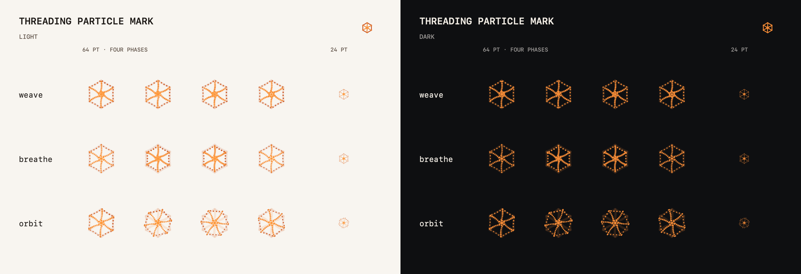

# Component showcases

## Threading particle mark

This is a deterministic capture of the real AppKit
`Sources/Threading/UI/Design/ThreadingMarkView.swift`, not a redrawn logo. Each row shows four
phases of one particle treatment at 64 points and its compact 24-point sidebar form, under both
light and dark appearances. The small vector mark in each heading is the resting state.

The interactive version lives in Threading's Component Gallery. The generic ThinkingOrbs
package keeps its own state showcase in `Packages/Vendor/ThinkingOrbs/docs/orbs.png`; Threading's shield,
six strands, per-particle colour ramp, and pointer behavior remain application-specific.
