# Declarative native extension UI

Threading extensions describe meaning; Threading owns the AppKit views and pixels. This is the
middle ground between a tiny fixed widget catalogue and arbitrary HTML: the vocabulary is small,
composable, theme-aware, accessible, and broad enough to express interfaces the host did not
anticipate by name.

An extension therefore does **not** request an ArtifactKit tree view, a bundle-size chart, or an
iOS-release comparer. It combines ordinary semantic nodes with a generic scene. The same scene
can represent a treemap, heatmap, bar chart, timeline, scatter plot, bubble plot, dependency map,
or another bounded visualization.

## Architecture

```mermaid
flowchart LR
    subgraph Producers["Extension-side producers"]
        MCP["MCP tool result"]
        Analyzer["Analyzer or local service"]
        State["Extension process state"]
    end

    subgraph SDK["Foundation-only ThreadingExtensionKit"]
        Nodes["ExtensionNode tree<br/>text · status · stack · button"]
        Controls["Native value nodes<br/>textInput · picker"]
        Scene["ExtensionScene<br/>normalized semantic marks"]
        Validate["Surface vocabulary + limits<br/>validate before publication"]
    end

    subgraph Host["Threading host"]
        Wire["Versioned JSONL process boundary"]
        Localize["Package localization resolver"]
        Renderer["ExtensionNodeRenderer"]
        Design["UI/Design AppKit components<br/>theme · focus · accessibility"]
        Panel["Persistent display-pane tab"]
        Event["ExtensionActionRequest<br/>actionID + correlated value"]
    end

    MCP --> State
    Analyzer --> State
    State --> Nodes
    Nodes --> Controls
    Nodes --> Scene
    Controls --> Validate
    Scene --> Validate
    Validate --> Wire
    Wire --> Localize
    Localize --> Renderer
    Renderer --> Design
    Design --> Panel
    Panel --> Event
    Event --> Wire
    Wire --> State
```



This separation is load-bearing:

- producers may inspect an `.app`, `.ipa`, IPSW, mounted firmware image, build directory, or any
  other artifact, but the UI contract does not know those formats;
- `ThreadingExtensionKit` contains values and validation only, with no AppKit or SwiftUI import;
- the host chooses native controls, typography, colours, spacing, hover, focus, and accessibility;
- interaction returns stable semantic values, so the process can replace the panel with its next
  state;
- no extension-supplied view, drawing closure, JavaScript, CSS, raw colour, or arbitrary path
  crosses the safe boundary.

## Native value nodes

`textInput` represents either an ordinary editable value or a search/filter value:

```swift
.textInput(
    id: "filter-artifacts",
    value: filter,
    placeholder: "Filter files, frameworks, or packages",
    accessibilityLabel: "Filter artifacts",
    role: .search,
    isEnabled: true
)
```

Submitting the field raises `filter-artifacts` and sends its current string as
`ExtensionActionRequest.value`.

`picker` represents one choice from stable values with localizable titles:

```swift
.picker(
    id: "select-release",
    selection: "ios-26.5",
    options: [
        .init(value: "ios-26.4", title: "iOS 26.4"),
        .init(value: "ios-26.5", title: "iOS 26.5")
    ],
    accessibilityLabel: "Release",
    isEnabled: true
)
```

Changing the choice raises `select-release` with the selected option's `value`, not its title.
Values are process data and are not localized.

## Semantic scenes

An `ExtensionScene` contains normalized marks in a top-leading coordinate space. Geometry is
between zero and one, independent of the eventual panel width:

```swift
.scene(
    ExtensionScene(
        accessibilityLabel: "Installed-size map for iOS 26.5",
        preferredAspectRatio: 1.55,
        items: [
            .init(
                id: "system-library",
                frame: .init(x: 0, y: 0, width: 0.62, height: 0.58),
                color: .category1,
                label: "System Library",
                detail: "4.82 GB · +114 MB",
                actionID: "inspect-artifact",
                isSelected: true
            )
        ]
    )
)
```

Each mark declares:

- a stable ID and normalized rectangle;
- a host-owned shape: rectangle, rounded rectangle, or ellipse;
- a semantic colour role: neutral, accent, status, or one of six peer categories;
- optional visible label and detail;
- optional explicit accessibility label and value;
- optional action ID, enabled state, and selected state.

Activating a mark raises its `actionID` with the mark ID as the correlated string value. A mark
without an action remains an informative accessibility element. Array order is paint order, so
overlapping marks can express scatter and bubble plots as well as non-overlapping treemaps.

The scene intentionally has no axes, legend, tooltip-placement, or file-tree semantics. Those can
be composed from text, stacks, status values, pickers, and marks. Add a semantic primitive only
when several extensions cannot state an important meaning with this vocabulary; do not add a new
host view for each extension domain.

## Surface limits

Full extension panels allow text input, up to 100 options per picker, and up to 500 marks per
scene, inside the existing 24-level/500-node tree and 1,000-rendered-element aggregate budgets.
Compact component contracts continue to
disallow these nodes unless their published constraints opt in:

- `allowsTextInput` gates editable fields;
- `maximumPickerOptions == 0` disallows pickers;
- `maximumSceneItems == 0` disallows scenes.

The host validates that complete tree before showing any part of it, then virtualizes the direct
and nested children of vertical stacks as reusable viewport rows. Express a long linear document
or repeated collection as vertical-stack children so hidden rows do not own AppKit controls.
Horizontal stacks, overlays, scenes and disclosures are intentionally atomic compositions: putting
hundreds of repeated elements inside one of those nodes still creates one large eager row and the
aggregate contract limit does not make that work frame-cheap.

This is why a rich ArtifactKit map belongs in its display-pane panel while a sidebar contribution
remains a compact reading or action. The vocabulary can grow without silently turning every
small host surface into a miniature application.

## Visual verification

Contract tests prove Codable shape, limits, localization, and correlated action values. Renderer
tests prove native control types, accessibility roles, and theme-boundary compliance. For spatial
UI, the rendered screenshot is the visual source of truth: review it at a realistic panel width
and under an authored theme to catch crushed geometry, incorrect coordinate conversion,
unreadable labels, and theme leakage that structural assertions cannot see.

The in-repository ArtifactKit preview is deliberately only a proving fixture. Real artifact
inspection and comparison can live in a standalone analyzer and an extension/MCP adapter that
both produce the same semantic model; neither requires a second rendering system.
