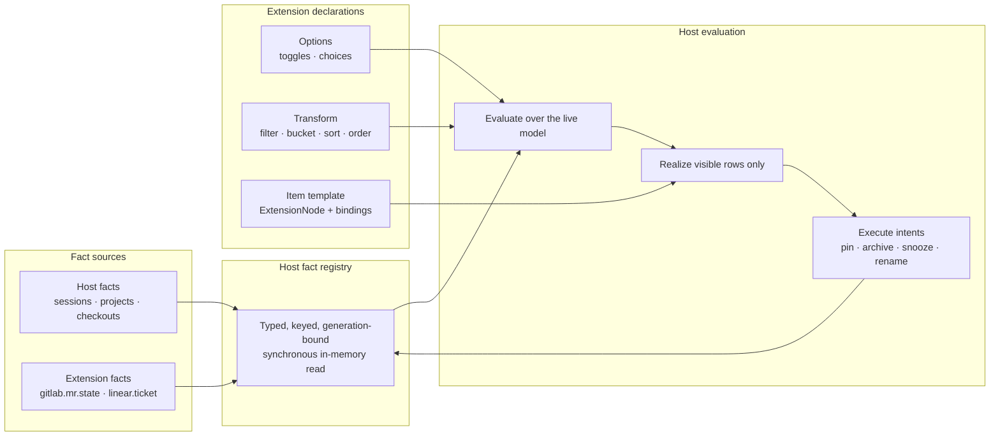

# The Navigator Pipeline

> Status: active feature draft — the product goal is that a user who wants a different sidebar
> can have one, built by an extension, without Threading having anticipated the shape they wanted. The
> durable work is a five-stage pipeline — facts, options, transform, structure, representation —
> plus a host-executed intent vocabulary. Rollout steps 1–5 and the initial intent contract were
> implemented by 2026-08-30; the three reference extensions now build from the public SDK,
> dynamic registered-provider facts are selectable through host-owned Group by and Sort by
> controls, and pipeline collections may expose their complete host-virtualized ordering.
> Native convergence remains open.
> No part of
> `ui.workspace-navigation` v1 is withdrawn.

## Decision

Model a navigator as a **transform over facts**, not as a document an extension renders.

- Threading publishes typed **facts** about entities. Extensions may publish facts too, against
  domain keys they already understand, without implementing any UI.
- A navigator extension declares **options** — the user-facing sorting, grouping and filtering
  choices it wants to offer. Threading renders and persists them.
- It declares a **transform**: filter, bucket, sort, section-order, expressed over facts and
  option values. **Threading evaluates it**, natively, over its own model.
- It declares the **output shape** (list, outline, grid, sections) and one **item template** with
  bindings to facts. Threading realizes the template per visible row.
- Row actions bind to a host-owned **intent** vocabulary. The first shipped slice is pin, unpin,
  and archive, which Threading executes, refuses, persists and undoes.

What crosses the process boundary is the *rule*, never the *result*. That is the whole design.
It is what lets a navigator sort five thousand sessions at native speed, repaint one row on an
activity edge, and stay correct while its extension process is asleep.

The native sidebar becomes the reference implementation of the same pipeline. Not for purity —
because it is the only test that stays honest. If native needs a fact or an option the vocabulary
cannot express, the vocabulary is incomplete, and a build lint should say so before somebody
discovers it while trying to build a different sidebar.

Three example extensions are the acceptance criteria, and one of them has no UI at all.

## Why the current system is close, but not enough

`ui.workspace-navigation` already exists and its instincts are right.
[`WORKSPACE_NAVIGATORS.md`](../extensions/WORKSPACE_NAVIGATORS.md) is explicit that the name is
deliberately not "project sidebar" — *"a navigator may be a project/thread outline, an activity
inbox, a sectioned lifecycle view, a grid, or a composition."* The host already owns the split
column, resize and collapse, focus routing, theme, entity validation, collection virtualization
and an always-available failback to Native. `WorkspaceSidebarContainerViewController` owns
selection persistence and generation replacement; `WorkspaceNavigatorHostViewController` owns one
validated document and its virtualized renderers.

Five walls make the two sidebars we actually want to build impossible. Each was found by taking a
screenshot of a real product and asking what it would take.

**1. The published data cannot express the view.** `ExtensionSessionSnapshot`
(`ExtensionHostData.swift:64`) carries id, projectID, providerID, accountID, displayTitle,
activity, branch, isSideChat, isArchived and usesNativeUI. There is **no timestamp of any kind**.
A ChatGPT-style *Priority / Today / Yesterday* inbox needs a time before it needs anything else.
Also absent: pinned, snoozed, unread, `lastTurnAt`, model, cost, and any session-scoped worktree
identity — `ExtensionProjectSnapshot.repository` already publishes host, path, branch and head
revision at *project* scope, and `GitInfo.worktreeIdentity(for:)` exists host-side, but nothing
ties a session to its worktree across the boundary.

**2. Activity is flattened past the point of usefulness.**
`LiveExtensionHostSnapshotProvider.extensionActivity` (`ExtensionHostSnapshots.swift:190`) folds
`awaitingUser`, `needsAttention` and `limitReached` into a single `needs-attention`. That was a
correct call for a published vocabulary installed extensions already switch on, and it means a
"Priority" section cannot tell *a turn stopped waiting on you* from *finished and unread* from
*the account is spent*.

**3. Before rollout step 1, the document was pull-only and refreshed by the wrong signal.**
`loadActionID` fires when the host asks; the host asks on `ProjectsDidChange`. Activity changes did
not re-render a navigator, and the process had no way to push one — the SDK has
unsolicited publication for other surfaces (`ExtensionHostClient.publishComponentPatches`,
`publishIdentityResolutions`), but a navigator only ever arrives as a field of an action
*response*. A live spinner in an extension navigator was frozen. The host
**already** journals exactly this edge for extensions: `ExtensionHostService` observes
`SessionActivityDidChange` and emits `session.changed` into the cursor-paged event stream. The
first rollout slice now forwards that edge to the selected v1 navigator and accepts bounded
content-only item patches; the durable contract is in
[`WORKSPACE_NAVIGATORS.md`](../extensions/WORKSPACE_NAVIGATORS.md#live-session-edges).

**4. Rows can navigate; they cannot act.** The host capability list in `ExtensionManifest.swift`
grants reads and event subscription (`host.events`) and nothing else — no mutation authority of
any kind — so pin, archive, snooze, rename, new-session and move-to-project are all unavailable.
Both reference screenshots have row actions.

**5. Budgets and interaction.** `maximumItems = 1_000` aggregate
(`ExtensionWorkspaceNavigator.swift:370`); this repository's own sidebar performance notes are
written against five-thousand-session stores. No context menu, no drag and drop, and continuous
search is one IPC round trip per keystroke by design.

Walls 3 and 5 share one cause: v1 puts the extension process **inside the render path**. This
repository already ruled on that question once, in
[`COMPONENT_CUSTOMIZATION.md:270`](../extensions/COMPONENT_CUSTOMIZATION.md), under the heading
*Runtime registry, not runtime IPC*:

> AppKit can reconfigure sidebar rows many times per second. It must never synchronously call an
> extension process from `configure`, layout, drawing, or accessibility methods.

Component customization obeys that rule — extensions publish patches, the host validates and
stores them in a main-actor registry, views do a synchronous in-memory lookup. Navigators do not.
This draft applies the existing ruling to the surface that needs it most.

## The pipeline



Nothing in the render path is an IPC call. An extension publishes declarations and facts when it
has something to say; the host reads them synchronously forever after.

## Stage 1 — Facts

A fact is a typed value about an entity, keyed so that anything resolving to the same key inherits
it.

```swift
ExtensionFact(
    key: "gitlab.mr.state",
    subject: .repositoryBranch(repository: repositoryIdentity, branch: "release/12.14.x"),
    value: .string("merged"),
    label: "Merged",
    status: .positive,          // ExtensionStatusRole — host picks the colour
    icon: .hostAsset(...),      // optional
    observedAt: date
)
```

The `value` is the fact's one scalar, and it is all a transform ever sees. `label`, `status` and
`icon` are presentation riding along; they never participate in sorting, grouping or filtering.
A provider with two sortable things — an MR state and a discussion count — publishes two keys.

### Host facts and the parity invariant

Threading publishes what it already knows. The rule is not "add fields as somebody asks" but an
invariant worth enforcing mechanically:

> Any fact `SessionRowView` or `SidebarTreeBuilder` consults to draw or order a row must exist in
> the published fact vocabulary.

That is what turns "anything is buildable" from a slogan into a gate. A boundary lint in the
family of `scripts/check_architecture_boundaries.sh` fails the build when the native sidebar reads
a session property that no fact publishes; it must exclude the stale SDK copy under
`docs/references/chrome/.generated/`, which shadows every ThreadingExtensionKit symbol a grep
would anchor on. Today the lint would fail immediately on `isPinned`
(`SidebarOutlineNodes.swift:506`), `lastActiveAt` (`:515`), snooze state (`:490`), `displayTitle`
— whose value turns on the `usesAgentTitleInSidebar` preference down in `Project.swift` — the
full six-case `SessionActivity`, and the per-project manual ordering behind *Sort by Order Added*
and drag reorder. The manual order is the easy one to miss: a user-arranged order is host state
like any other, and if it is not a fact, no extension navigator can offer the native sort's
default.

Activity fidelity is versioned rather than changed: `session.activity` keeps publishing the
existing four-value vocabulary, and `session.activity.detailed` publishes all six. An extension
built against v1 sees exactly what it saw before.

### Rollout step 2 implementation

The host-only fact foundation now ships as three bounded pieces:

- `HostFactCatalog` is the canonical, versioned inventory of 41 host facts and 31 exact native
  sidebar dependencies. `HostFactPublisher` projects live session, project and terminal state into
  the bounded, generation-aware `ExtensionFactRegistry`; application launch starts the pipeline
  only after the stores are ready.
- `SessionRowView` and `SidebarTreeBuilder` classify every value they draw or order through eager
  identity markers for published facts, user options and deliberately host-owned state. Local
  shared-git-directory paths remain host-only, and manager relationship and manager role remain
  separate facts.
- `check_navigator_fact_parity.py`, run by the architecture boundary build phase, derives its
  accepted vocabulary from compiler-visible Swift inventories. Model members, provider methods,
  entry inputs and option/host sources all have exact owners. A new native read without an owner
  fails; typed option, host and entry-input owners without an audited occurrence also fail. Its 82
  adversarial fixtures cover aliases, lexical shadowing, dependency injection, closures, key paths
  and local collection projections; generated SDK references, comments and strings cannot satisfy
  the audit.

The markers add no rendering work beyond inline identity calls. The supported sidebar stress
profile passed with 10 projects and 5,000 sessions: 5,059 ordered rows, 33 instantiated views and
149.428 ms navigator load. This slice intentionally changes no appearance or interaction.

### Extension facts, and why the key matters

A GitLab extension does not know what a session is. It knows repositories, branches and merge
requests. If it had to publish against session IDs it would need `host.sessions.read`, and it
would have to re-resolve that mapping every time a session changed branch or was forked.

So facts are keyed by **domain key**, and the host performs the join:

| Subject | Inherited by |
|---|---|
| `.session(id)` | that session |
| `.project(id)` | that project only; a later transform may opt into project-to-session inheritance |
| `.repositoryBranch(repository:branch:)` | every session, checkout and project on that branch |
| `.repository(identity)` | everything in that repository |

Both halves of the branch key exist today, but they are **not the same key, and the join is new
work**. `GitInfo.repositoryIdentity` — what the sidebar uses to group checkouts
(`SidebarOutlineNodes.swift:328`) — is the shared git directory's local filesystem path. The
boundary-safe identity is derived separately from the `origin` remote
(`ExtensionHostSnapshots.swift:171`) and crosses as `ExtensionRepositorySnapshot`: host plus
path, no credentials, no remote URL, no local filesystem path (`ExtensionHostData.swift:5`). The
host therefore maintains the mapping between its path-keyed grouping and the published identity.
A repository with no remote has no published identity at all, and facts against `.repository` or
`.repositoryBranch` reach nothing there — which is correct: a forge provider has nothing true to
say about a repository it cannot name.

The result: **a GitLab extension needs no session capability at all**, and a session forked onto a
new branch picks up the right merge-request state without the provider being told.

### A fact is queryable; a patch is only renderable

`sidebar.session-row@1` already lets an extension put something on a native row — its `after-title`
slot takes one status node of at most 24 characters
([`COMPONENT_CUSTOMIZATION.md:268`](../extensions/COMPONENT_CUSTOMIZATION.md)). That is a
pre-rendered visual bound to one component contract. Nothing can sort by it, group by it, filter on
it, or show it anywhere else.

Both mechanisms should exist, with one rule:

- publish a **fact** when you know something true about an entity;
- publish a **patch** when you know what a specific surface should look like.

Data goes through facts. A transform can only sort, group or filter by things that are facts.

### Installing a provider grows other people's menus

Because facts are typed and self-describing, a navigator can offer *Group by…* and *Sort by…* over
whatever facts are registered right now, including ones it has never heard of. Install GitLab and
**MR state** appears in the group-by menu of a sidebar written before GitLab existed. Uninstall it
and its key stops being offered as a live choice, while a retained selection appears as
unavailable; rows that had been grouped by it fall into an `unknown` bucket rather than the
transform failing. Reinstall the same key and the user's arrangement resumes.

This is the payoff of the whole model, and the reason facts must be a host registry rather than a
private channel between two extensions.

### A navigator declares what it consumes

The manifest already knows how to say "this extension needs that one":
`ExtensionManifest.serviceDependencies` names a `providerIdentifier/serviceID@version` with a
`required` flag, paired with the `services.provide` / `services.consume` capabilities. Fact
consumption rhymes with that, with one deliberate difference: a navigator declares the **fact
key**, never a providing extension. Any provider publishing `gitlab.mr.state` satisfies the
declaration, so providers stay substitutable and the registry stays a host surface.

A consumed key carries one of two strengths; the third case needs no declaration at all:

- **`required`** — the fact is the navigator's point: an MR board without MR state is nothing.
  With no registered provider the host does not half-render. It shows a placeholder naming the
  missing fact, keeps the route back to Native, and Settings can suggest providers that publish
  the key.
- **`enhances`** (the default) — the transform degrades stanza by stanza under the absence rule
  in [Stage 3](#stage-3--the-transform): sort keys drop out, buckets collapse, predicates are
  dropped rather than emptying the view.
- **Dynamic** — options offered over whatever facts are registered right now, per the previous
  section. Nothing to declare; the menu is the declaration.

The declaration also closes a hole this draft would otherwise carry: the provider-cost mitigation
under [Risks](#risks) — telling a provider which keys are actually consumed — presupposes the
host knows the consumers. A static `consumes` list is that knowledge before anything renders, and
it gives Settings something legible to show beside an install.

### Lifecycle, staleness and bounds

Facts follow the precedent `ComponentCustomizationRegistry` set, keyed by extension ID, process
generation, fact key and subject. Disable, crash, reload or token revocation drops that
generation's facts atomically, and the surfaces reading them return to their default without
waiting for the old process.

`observedAt` is mandatory because a dead provider's merge-request state must stop reading as
current truth. The host decides when a fact is stale and how a stale fact presents; the provider
does not get to assert freshness it cannot back up. The current host policy caps every extension
observation at 15 minutes from the earlier of `observedAt` and host receipt. Expiry makes that
subject value unknown while leaving the provider definition live, falls through to the next fresh
provider in deterministic order, and is reversed by a fresh publication.

Providers are never called during render. They publish on host events, on their own schedule, or
on an explicit refresh, and reach the network through `network.brokered` under the grant rules
[`github.md`](../architecture/github.md) already documents. Bounds: a cap on facts per subject,
a cap on total facts per extension generation, a value-size cap, and coalesced publication.

Two extensions publishing the same compatible key resolve to one choice and one value. Persisted
provider ordering is not shipped yet: providers currently have equal priority, so extension
identifier and process generation provide a deterministic tie-break independent of startup order.

## Stage 2 — Options

The extension declares the user-facing choices it wants; Threading renders them in the navigator's
own `⋯` menu, persists them per user and per scope, and re-evaluates the transform when one
changes.

The vocabulary is the one `ExtensionSettings.swift` already has — `toggle(defaultValue:)` and
`choice(defaultValue:options:)` — scoped to the surface rather than to the Settings window. Option
values are inputs to the transform like any fact.

This makes the native menu unremarkable rather than special. *Group Sessions by Branch*,
*Headings for Lone Branches*, *Compact Tree*, *Sort by Order Added / Recent Activity / Name* and the
direction pair are exactly the built-in navigator's option set, stored today under
`groupsSessionsByBranch`, `groupsLoneBranches`, `compactsSidebarTree`, `sidebarSessionOrder` and
`sidebarSessionOrderIsReversed` (`AppSettings.swift:531-634`).

## Stage 3 — The transform

### Where it runs, and why

In the host. The extension ships a declaration; the host evaluates it against the live model.

That choice buys four properties v1 cannot have: sorting thousands of sessions at native speed
without serializing them; re-evaluating on an activity edge without a round trip; a correct
navigator while the extension process is asleep or dead; and search that filters per keystroke
without IPC.

The cost is that the transform is a small language rather than arbitrary code, which is the usual
objection to declarative pipelines — *what if my grouping is too weird to express?* The answer is
stage 1: compute the weird thing off-line in your own process, publish it as a fact, and group by
the fact. That is also why the fact table and the transform have to ship together.

### Vocabulary

```
transform:
  filter:  predicate over facts and option values
  match:   the host search field's live query, over facts declared searchable
  bucket:  by fact | by relative-date fact | by fixed rules
  sort:    ordered list of keys, each with a direction
  order:   how buckets themselves are ordered
```

Predicates and sort keys name facts. Sort keys may be multi-level, which is what makes the
question that started this draft — *should pinned rows be sorted by activity within the pinned
block?* — an option a user picks rather than a policy the app holds.

Absence has two pinned meanings, and the distinction is what makes degradation graceful. A fact
missing **for a subject** while its key has a live provider uses the operand's declared fallback
before predicate, sort, or fact-bucket evaluation. Without a fallback it is unknown: the predicate
does not match, the sort orders the row after every present value, the bucket is `unknown`. A fact key
with **no registered provider at all** degrades at the stanza instead: the predicate is dropped
rather than excluding everything, the sort key leaves the key list, the bucket grouping
collapses. An uninstall must widen a navigator back toward "all sessions", never empty it.
Nothing is left to the evaluator's judgement; a transform wanting different behaviour declares a
default on the binding.

The format-1 declaration makes “stanza” exact. An unavailable `enhances` key removes one search
field, filter clause, sort clause, fact-bucket clause, rule-bucket rule, or conditional template
node. Nested predicates never simplify piecemeal. Presentation leaves use their fallback and are
omitted without one; an empty realized row is not selectable. Search disappears only when all its
fields are gone, rule buckets collapse only when no rules survive, and a fact bucket collapses as
one unit. A missing `required` provider disables the complete navigator. Subject-level absence
continues to use unknown/fallback semantics even for a `required` key whose provider is live.

Project facts do not inherit to sessions by default. A format-1 reference opts into `.project`
scope and must consume `session.project-id` as the explicit join. A session without that join has
an unknown project-scoped value; it does not make the project fact provider unavailable.

The one primitive that cannot be faked is the relative-date bucket. *Today*, *Yesterday*,
*Last 7 days* are relative to a clock, and if each navigator brought its own they would disagree
and none of them would re-bucket at midnight. So the **host owns the clock**, publishes the named
buckets, and owns the invalidation when the day rolls over. The ChatGPT-style inbox is the reason
this primitive exists.

### Search is a host control feeding the transform

v1 keeps continuous search deliberately explicit — a text input action, one IPC round trip per
keystroke ([`WORKSPACE_NAVIGATORS.md`](../extensions/WORKSPACE_NAVIGATORS.md#search-and-privacy)). The pipeline
earns its per-keystroke claim only if search is part of the vocabulary: the navigator declares a
search field and which facts are searchable, the host owns the control and its live text, and the
query enters the transform through `match` the way an option value does. No keystroke ever
crosses the process boundary — which is also the privacy property v1's explicit design was
protecting, kept under a faster mechanism.

### Escape hatch

A navigator may still declare `loadActionID` and return a fully materialized document, exactly as
v1 does. It keeps working, it is the right answer for a navigator whose content is not the host's
model at all, and it carries v1's costs. The declarative path is the default because it is the one
that scales.

## Stage 4 — Output

Unchanged from v1 in shape: sections, and a list, outline or grid, with stable IDs the host diffs
so selection, expansion, scroll position and first responder survive a re-evaluation. What changes
is that the host produces this by evaluating the transform rather than receiving it.

Format 1 keeps the finite bridge when `output.windowing` is absent: it emits at most 1,000 items
and requires a host-owned overflow notice rather than truncating silently. The additive
`hostVirtualized` mode retires that aggregate presentation bound without breaking an older host:
the host evaluates the full ordering, retains lightweight identities, and realizes only the
visible range. The bound that matters then is the viewport, not the store.

## Stage 5 — Representation

One template per collection, not one node tree per row:

```swift
.item(
    template: .stack(axis: .vertical, spacing: .tight, children: [
        .text(.field("session.title"), role: .body),
        .stack(axis: .horizontal, spacing: .tight, children: [
            .image(.field("project.icon"), role: .icon),
            .text(.field("project.name"), role: .compactDetail),
            .flexibleSpacer,
            .status(.field("gitlab.mr.state"), role: .field("gitlab.mr.state.status"))
        ])
    ])
)
```

`ExtensionNode` gains binding expressions wherever it takes a literal today. A binding names a fact
and may declare a fallback for when that fact is absent, which is how a template survives an
uninstalled provider.

This is what makes virtualization real: one declared template, realized for visible rows only, and
a changed fact repaints the rows bound to it instead of replacing a document.

## Intents

Reading and arranging is the pipeline; changing things is not, and should not be smuggled in as a
sixth stage. Row actions bind to a **named intent** the host executes:

The implemented initial vocabulary is `pin` · `unpin` · `archive`. Possible later additions are
`snooze(until:)` · `rename` · `new-session(project:)` · `move-to-project` · `open-in(app:)`; none
of those later verbs is part of the public contract yet.

The host owns validation, the confirmation where one is due, persistence failure, the undo, and the
toast. It may refuse. This is the same shape as v1's `.destination`, which is already an intent the
host validates and performs — navigation with a verb.

A navigator's manifest declares which intents it binds, for the same reason facts declare
consumption: legibility. `pin` and `new-session(project:)` are not the same size of verb, and the
person approving a navigator should see the verbs it can ask for before it asks.

Intents originate from a user gesture in a navigator, never from a fact provider. A GitLab
extension archiving a session because its MR merged is the consent problem that made
`host.sessions.write` a rejected alternative, wearing a nicer name.

This is deliberately **not** `host.sessions.write`. An extension never mutates the store; it asks
for a named product action that the host would have performed if the user had used the native
affordance.

## What stays host-owned

The split column, resize and collapse, focus and keyboard routing, selection, virtualization and
row reuse, theme resolution, accessibility semantics, drag mechanics, the clock, option
persistence, entity validation, every mutation, and the always-available route back to Native.

An extension that dies mid-interaction costs its facts and its declarations. It cannot cost the
sidebar.

## Scaling contract

Per the [Scaling Gate](../../CLAUDE.md#scaling-gate), stated before implementation:

| Quantity | Expected | Stress |
|---|---|---|
| Sessions in store | 200 | 5,000 |
| Projects | 20 | 200 |
| Facts per subject | 3 | 32 |
| Fact publications per minute | 10 | 600 |
| Activity edges per minute | 20 | 300 |
| Visible rows | 30 | 60 |

- Transform evaluation is O(n log n) over sessions on a structural change, O(changed) on a fact
  edge — a fact change that cannot reorder must repaint only the bound rows.
- Row realization is O(visible). A template is realized per visible row and never for the store.
- Fact reads during `configure`, layout, draw and accessibility are synchronous in-memory lookups.
  No IPC, no filesystem, no process work.
- Fact publication is coalesced and bounded; a provider in a loop costs its own budget, not a
  frame.
- Freshness uses one lazy-invalidated deadline heap and one process timer. Provider publication
  updates only changed winning cells; refreshing a non-earliest cell does not reset the timer,
  and deadline debris is compacted at twice the retained-cell count.
- Option changes re-evaluate one navigator, not the window.
- An opt-in deterministic stress fixture drives 5,000 sessions with a synthetic provider at the
  stress publication rate, measuring background evaluation, main-thread mount, scroll tail and
  live view count, per
  [`performance.md`](../architecture/performance.md).

## Acceptance criteria

Three extensions ship in `Packages/ThreadingExtensionKit/Examples/`, beside
`HelloStatusExtension`. If one of them cannot be built from the published SDK, the SDK is not
finished — which is a far better forcing function than a feature checklist.

**1. [`T3SidebarExtension`](../../Packages/ThreadingExtensionKit/Examples/T3SidebarExtension)** —
flat session list, project as subtitle, pinned block on top, hover pin and archive actions.
Exercises: templates, intents, options, pinning facts.

**2. `ActivityInboxExtension`** — the ChatGPT-style inbox: *Priority* section for sessions blocked
on the user, then *Today* / *Yesterday* / *Last 7 days*, live spinner on working sessions.
Exercises: relative-date buckets and the host clock, detailed activity fidelity, live fact edges,
section ordering.

**3. `GitLabStateExtension`** — **no UI at all**. Publishes `gitlab.mr.state` against
`(repository, branch)`, and nothing else. Exercises: the fact registry without any navigator
capability, the domain-key join, staleness, brokered network, and the claim that installing it
makes MR state groupable in the other two — and in the native sidebar — without either of them
knowing it exists.

## Rejected alternatives

**Ship the transform as extension code called per render.** This is v1. Rejected by the existing
ruling in `COMPONENT_CUSTOMIZATION.md:270`, and independently by the 5,000-row and
per-keystroke-search cases.

**Raise `maximumItems` and add a push channel to v1.** Buys the live spinner and defers the rest.
It does not make anything sortable by an extension-supplied value, does not remove the search round
trip, and leaves every navigator re-serializing the whole store on each edge. Worth doing *only*
as the first slice below, on the way to the pipeline.

**A general expression language.** Rejected on `DECLARATIVE_UI.md`'s own terms: extensions
"describe meaning" while Threading owns the views and pixels, and a primitive is added "only when
several extensions cannot state an important meaning with this vocabulary". An expression language
inverts both — it is how a contract quietly becomes an API on the host's internals. Facts plus a
small predicate/sort/bucket vocabulary, with off-line computation as the escape hatch, covers the
cases without it.

**`host.sessions.write`.** A general mutation capability has no user-legible consent story, no
natural undo, and makes every future store invariant an extension's business. Named intents have
all three.

**Let extension facts silently change the native sidebar's order.** Rejected. Facts may *appear*
in native's group-by and sort-by menus, but only a choice the user makes changes what the sidebar
does. An install must never reorder somebody's sidebar on its own.

## Risks

- **Vocabulary lock-in.** Facts are a published schema; a wrong key shape is expensive later.
  Mitigation: version each fact key, publish the four-value activity alongside the six-value one,
  and start with the keys the native sidebar provably reads.
- **The transform grows into a language.** Mitigation: every proposed addition must first be shown
  to be impossible as an off-line fact.
- **Fact-provider cost.** A provider polling a forge for hundreds of branches is a real cost the
  user did not ask for. Mitigation: the `consumes` declarations plus subject-scoped subscriptions
  tell a provider which keys and subjects are actually being consumed, and the existing
  brokered-network grant rules bound the rest.
- **Parity lint churn.** The invariant will fail the build the first time somebody adds a field to
  the native row. That is the point, but it needs a documented, cheap way to add the fact in the
  same change.
- **Concurrent surfaces.** This draft touches the extension boundary while other work is in flight
  there — the working tree already adds capabilities (`host.project.files.read`, the attachment
  surfaces) inside ranges this draft cites. Re-check `ExtensionHostData.swift` and
  `ExtensionContributions.swift` against `main` before implementing.

## Tests

- Transform evaluation unit tests: each vocabulary element, ties, missing facts, unknown buckets,
  option interaction, and the reversed direction of each sort key.
- Relative-date bucketing across a day boundary, a DST transition and a timezone change, with an
  injected clock.
- Fact registry: generation drop on crash/disable/reload, staleness presentation, per-subject and
  per-generation caps, duplicate-key ordering resolution.
- Join correctness: a session that changes branch inherits the new branch's facts; a fact against a
  repository reaches every checkout; a fact against an unknown key reaches nothing.
- Parity lint: a fixture native row reading an unpublished field fails the check.
- Degradation: a `required` fact key with no registered provider presents the placeholder, never a
  half-render; uninstalling a provider widens an `enhances` navigator back toward all sessions
  rather than emptying it; a fact absent for one subject under a live provider stays strict for
  that subject.
- Search: the host-owned query filters per keystroke with zero process messages, and matches
  extension facts declared searchable.
- Rendered-state tests for all three example extensions, light and dark, per the house convention
  that appearance is reviewed in pictures.
- Stress fixture per the scaling contract, with before/after recorded in `performance.md`.
- Failback: a navigator whose process dies mid-scroll returns to Native with selection intact.

## Rollout

1. **Live edges on v1 — implemented 2026-08-29.** The selected navigator may opt into coalesced
   `session.changed` actions and return bounded content-only item patches. This ships the live
   spinner path and proves targeted virtual-row replacement without giving the extension
   structural or interaction authority.
2. **The fact registry — implemented 2026-08-30.** Host facts only, plus the fail-closed parity
   lint. Nothing outside the host consumes it yet.
3. **Extension fact providers and the domain-key join — implemented 2026-08-30.** Providers
   publish generation-bound facts only on canonical repository subjects. The host synchronously
   resolves exact, repository-branch, then repository facts from its in-memory catalogue without
   exposing project or session identifiers. `GitLabStateExtension` is the buildable public test:
   no UI, no session authority, exact anonymous `gitlab.com` network access, a stable maximum of
   32 repositories and 4,096 retained facts, bounded paging/concurrency/retry, atomic removal, and
   preservation of the last observation across non-authoritative refresh failures.
4. **Options — implemented 2026-08-30**, rendered in the navigator menu and persisted.
5. **Transform and templates — implemented 2026-08-30.** The
   `ui.workspace-navigation@2` contract adds `consumes` declarations, exact degradation tiers,
   host-owned search and calendar invalidation, background transform evaluation, virtualized
   visible-row template realization and source-session activation. v1 documents keep working; a
   materialized item list is a degenerate template. `ActivityInboxExtension` is the buildable
   public test: it requests only `ui.workspace-navigation`, while the host produces Priority and
   relative-date sections, persists its sort option and repaints working state from facts.
6. **Intents — implemented 2026-08-30.** `pin`, `unpin`, and
   `archive` are declared per navigator in the manifest, disclosed before enable/update, rendered
   inside the host's virtual row, and executed through native persistence/lifecycle paths without
   revealing the gesture, source session, or result to the extension. `T3SidebarExtension` proves
   the public contract with project-scoped subtitles, pinned-first sections, conditional host
   intents, a persisted sort option, and scheduled-row action omission.
7. **Registered-fact choices — implemented 2026-08-30.**
   A pipeline may declare one dynamic bucket picker and one dynamic sort picker. The contract pins
   host-owned None, selected-key retention, missing-last semantics, static composition, eligible
   subject kinds, localization, deterministic catalogue order and bounds without exposing the
   catalogue or selection to extension code.
8. **Windowed collections — implemented 2026-08-30.** Pipeline format 1 accepts the additive
   `hostVirtualized` output hint. A capable host retains the complete evaluated row ordering off
   the main actor and realizes only viewport templates; an older host ignores the hint and keeps
   the explicit 1,000-row compatibility notice.
9. **Native on the pipeline**, as far as it honestly goes. Full parity includes drag reorder,
   inline rename, LabelMorph titles and hover cards; the realistic target is that native's *facts*
   and *options* are the published ones, not that native is literally an extension.

## Open questions

- Is there a scope between "this user" and "this project" that navigator options need, given
  checkouts of one repository behave as separate projects here?

Two earlier questions are answered in the body: a fact's `value` stays scalar with `label`,
`status` and `icon` as non-sortable presentation ([Stage 1](#stage-1--facts)), and intents
originate only from a user gesture in a navigator ([Intents](#intents)).
